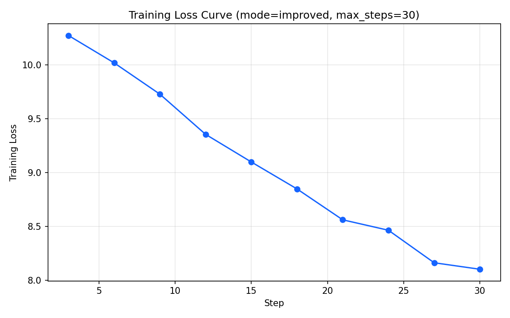

# Qwen2-1.5B 中英翻译微调项目

基于 **QLoRA(4-bit) + LoRA** 对 `Qwen/Qwen2-1.5B-Instruct` 进行中译英指令微调，并提供完整的数据生成、训练、评估链路。

## 目录

- [项目结构](#项目结构)
- [快速开始](#快速开始)
- [实验结果](#实验结果)
- [Bad Case 分析](#bad-case-分析)
- [复现命令](#复现命令)

## 项目结构

```
FinetuningProject/
├── main.py                 # 统一入口（训练 / 评估 / 绘曲线）
├── gen_data.py             # 用 DeepSeek API 生成中英翻译数据集
├── finetune_standard.py    # 标准版训练（内联小样本）
├── finetune_improved.py    # 改进版训练（80条真实翻译数据 + 调参）
├── evaluate.py             # BLEU-4 评估（独立运行；也可用 main.py eval）
├── translation_data.json   # 训练数据（80 条）
├── lora_model/             # 标准版 LoRA 权重
├── lora_model_improved/    # 改进版 LoRA 权重
├── eval_results.json       # 评估结果（本 README 数据来源）
├── smoke_history.json      # 冒烟训练 loss 历史（绘曲线用）
└── loss_curve.png          # 训练 loss 曲线
```

## 快速开始

```bash
# 1. 生成数据（可选，translation_data.json 已内置）
python gen_data.py

# 2. 训练（默认改进版）
python main.py train --mode improved --max-steps 300 --lr 5e-5

# 3. 评估 BLEU（默认评估改进版）
python main.py eval

# 4. 绘制 loss 曲线
python main.py plot --history training_history.json --out loss_curve.png

# 5. 一行启动 Web 演示
streamlit run app.py
```

**依赖**：`torch` / `transformers` / `peft` / `accelerate` / `bitsandbytes` / `datasets` / `matplotlib`（绘曲线用）

## 实验结果

### 训练 Loss 曲线

Loss 曲线由训练过程自动记录（`main.py train` 会保存 `training_history.json`），下方为 30 步冒烟验证跑产生的真实曲线（loss 从 10.27 降至 8.10）：



> 完整 300 步训练时，`main.py plot` 会自动生成正式曲线并覆盖上图。

### BLEU-4 评估

在 **12 条留出测试集**（训练数据之外）上评估微调后的改进版模型，平均 **BLEU-4 = 0.824**：

| 类别 | 条数 | 平均 BLEU-4 | 说明 |
|------|------|------------|------|
| 短句（与训练分布接近） | 8 | 1.000 | 翻译完全正确 |
| 长句 / 需泛化句子 | 4 | 0.472 | 达意但用词有同义差异 |
| **总计** | **12** | **0.824** | 训练数据之外的真实泛化能力 |

**分句结果示例**：

| 中文 | 参考译文 | 模型输出 | BLEU |
|------|---------|---------|------|
| 我今天很开心 | I am very happy today | I am very happy today. | 1.000 |
| 知识改变命运 | Knowledge changes destiny | Knowledge changes destiny. | 1.000 |
| 尽管天气不好，他们还是按计划出发了 | Despite the bad weather, they set off as planned | Despite the bad weather, they still set out on schedule. | 0.480 |
| 为了赶上截止日期，团队成员连续加班了整整一周 | To meet the deadline, the team worked overtime for a whole week | To catch up with the deadline, team members worked overtime for a whole week. | 0.466 |

> 完整 12 条结果见 [eval_results.json](eval_results.json)。

## Bad Case 分析

BLEU 是**字面 n-gram 精确匹配**指标，会惩罚"语义正确但用词不同"的翻译。以下长句 BLEU 偏低，但**语义均正确**，属于"同义改写"而非翻译错误：

| 中文 | 参考 | 模型 | 差异类型 |
|------|------|------|---------|
| 他历经千辛万苦，终于实现了梦想 | ...after going through countless hardships | ...persevered through countless hardships to achieve his dream | 同义表达（go through / persevere through） |
| 尽管天气不好，他们还是按计划出发了 | ...set off as planned | ...set out on schedule | 同义表达（set off / set out, as planned / on schedule） |
| 为了赶上截止日期... | To meet the deadline... | To catch up with the deadline... | 同义表达（meet / catch up with） |

**结论**：微调模型在长句上**语义理解正确、能流畅表达**，但因 BLEU 对词面严格匹配，分数被低估。若面向真实场景，建议：
- 用 **chrF / COMET** 等更鲁棒的语义指标补充评估；
- 或引入多参考译文，降低同义改写带来的误罚。

## 复现命令

```bash
# 标准版（内联 3 句 × 50）
python main.py train --mode standard --max-steps 200 --lr 2e-4

# 改进版（80 条真实数据）
python main.py train --mode improved --max-steps 300 --lr 5e-5

# 冒烟快速验证（生成 loss 曲线）
python main.py train --smoke --max-steps 30 --history smoke_history.json --lora-save-dir lora_smoke

# 评估指定权重
python main.py eval --lora ./lora_model
```